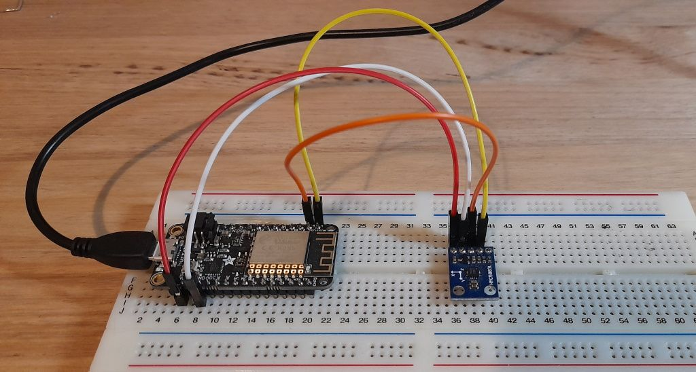
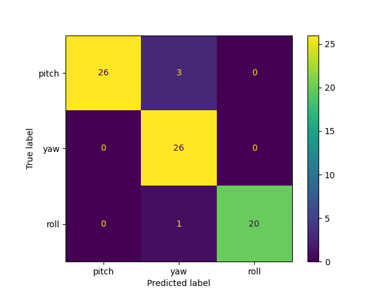

# ESP8266 Axis Prediction Using scikit-learn #

This example shows a working example of the ESP8266 using scikit-learn to predict yaw, pitch and roll movements.

### Hardware Used ###
* Adafruit Feather HUZZAH ESP8266
* HMC5883L Compass



### Data Collection ###

* Upload the ```compass``` sketch to the ESP to output serial data.

* I'm using wsl so I need to attach my usb device:<br />
```usbipd wsl list```<br />
```usbipd wsl attach --busid <your location>```<br />
```usbipd wsl detach --busid <your location>``` when done

* I prefer to load my environment using docker:<br />
```docker build -t esp8266_collection .```<br />
```docker run -it --rm -v <this folder>:/tmp --device /dev/ttyUSB0:/dev/ttyS1 esp8266_collection```

* Use ```python3 collector.py <yaw or pitch or roll>``` to Gather your IMU training data and save to a csv file. This script collects movement data for 30 seconds. Run this 3 times each time simulating yaw, pitch and roll movements with the compass.

* Run ```python3 train.py``` to create a model with the training data then convert the model to C for use on the arduino.

* Run the ```detection``` sketch with the generated model files to get movement predictions.

### Result ###
Output confusion matrix showing actual vs predicted test


### References ###
* https://github.com/emlearn/emlearn